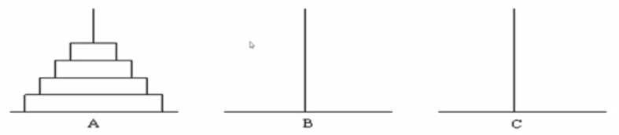

# **算法基础**

[程序设计与算法(二) 算法基础_中国大学MOOC (icourse163.org)](https://www.icourse163.org/course/PKU-1001894005) 

这个文档是这个课程的笔记。代码都是手敲，文字部分来自课程PPT，个人理解总结较少

**复习时一定补上！**🥕(挖坑)

...

## 枚举  

#### 完美立方

...

#### 生理周期

...

#### 称硬币

...

> ​	有12枚硬币。其中有11枚真币和1枚假币。假币和真币重量不同，但不知道假币比真币轻还是重。现在, 用一架天平称了这些币三次，告诉你称的结果，请你 找出假币并且确定假币是轻是重（数据保证一定能找出来）

> •**输入样例**  注意：天平左右的硬币数总是相等的 
>
> ABCD UFGH even (平)
>
> ABCI EFJK up (右向上)
>
> ABU EFGH even (平) 
>
> •**输出样例** 
>
> K is the counterfeit coin and it is light

...

假设A是轻假币，带入测试...再假设A是重假币，带入测试...

依次测试ABCD EFGH IJKL

```c
#include <iostream>
#include <cstring>
using namespace std;
char left[3][7];//表示天平左边硬币
char right[3][7];//表示天平右边硬币
char result[3][7];//表示称重结果
bool isFake(char c,bool light);
//light为真表示假设假币为轻，否则表示假币为重
int main(){
    int t;
    cin >> t;
    while(t--){
        for(int i=0;i<3;i++){
            cin >>left[i] >> right[i] >> result[i];
        }//将三组测量数据传入数组
        for(char c='A';c<='L';c++){
            //依次测试每个字符
            if(isFake(c,true)){
                cout << c << ",it is light.\n";
                break;
            }else if(isFake(c,false)){
                cout << c << ",it is heavy.\n";
                break;
            }
        }
    }
    return 0;
}
bool isFake(char c,bool light){
    for(int i=0;i<3;i++){
        char *pLeft,*pRight;
        if(light){
            pLeft = left[i];
            pRight = right[i];            
        }else{
            pLeft = right[i];
            pRight = left[i];
        }
        switch(result[i][0]){
            case 'u':s
                if(strchr(pRight,c)==NULL)
                    return false;
                break;
            case 'd':
                if(strchr(pLeft,c)==NULL)
                    return false;
                break;
            case 'e':
                if(strchr(pLeft,c)||strchr(pRight,c))
                    return false;
                break;
        }
    }
    return true;
}
```

...

## 递归

#### 求阶乘

📕:用递归解决多重循环

```c
int Factorial(int n){
    if(n==0){
        return 1;
    }else{
        return n*Factorial(n-1);
    }
}
```

...

#### 汉诺塔

汉诺塔是递归的经典问题...

> ​	古代有一个梵塔，塔内有三个座A、B、C, A座上有64个盘子，盘子大小不等，大的在下，小的在上。有一个和尚想把这64个盘子从A座移到C座，但每次只能允许移动一个盘子，并且在移动过程中，3个座上的盘子  始终保持大盘在下，小盘在上。在移动过程中可以利用B座，要求输出移动的步骤。

<p align="center"></p>

```c
int main(){
    int n;
    cin >> n;盘子的数目
    Hanoi(n,'A','B','C');//将A上的盘子移到C,B做中转
	return 0;
}
//将src上的n个盘子，以mid为中转，移到dest.
void Hanoi(int n,char src,char mid,char dest){
    if(n==1){//只有一个盘子
        cout << src << "->" << dest << endl;//将一个盘子直接从src移到dest
    	return;
    }
    else{
        Hanoi(n-1,src,dest,mid); //将n-1个盘子以dest为中转，移到mid
        cout << src << "->" << dest << endl; //将一个盘子从src移到dest
        Hanoi(n-1,mid,src,dest);//再将这n-1个盘子以src为中转，移到dest
    	return;
    }
}
```

...

#### N皇后

......

#### 逆波兰表达式求值

📕:用递归解决递归形式的问题

逆波兰表达式的定义： 

1) 一个数是一个逆波兰表达式，值为该数
2) `运算符 逆波兰表达式 逆波兰表达式`是逆波兰表达式，值为两个逆波兰表达式的值运算的结果.

> ​	例题：逆波兰表达式是一种把运算符前置的算术表达式，例如普通6  表达式2 + 3的逆波兰表示法为+ 2 3o逆波兰表达式的优点是运算符之间不必有优先级关系，也不必用括号改变运算次序，例如`(2+3)×4`的逆波兰表示法为* + 2 3 4。本题求解逆波兰表达式的值  其中运算符包括+ - * /四个。 输入 输入为一行，其中运算符和运算数之间都用空格分隔，运算数是浮点数输出，输出为一行，表达式的值。 

...

```c++
#include <cstdlib>
double exp(){
    char s[20];
    cin >> s;
    switch(s[0]){
        case '+':return exp()+exp();
        case '-':return exp()-exp();
        case '*':return exp()*exp();
        case '/':return exp()/exp();
        default: return atof(s);//把一个字符串转换成double类型
        break;
    }
}
int main(){
    pritnf("%lf",exp());
    return 0;
}
```

...

#### 表达式计算

📕:用递归解决递归形式的问题

......

#### 爬楼梯

📕:用递归将问题分解为规模更小的子问题进行求解

> ​	例题:咖哥爬楼梯，他可以每次走1级或者2级，输入楼梯的级教，求**不同的走法数**。
>
> ​	例如：楼梯一共有3级，他可以每次都走一级，或者第一次走一 级，第二次走两级，也可以第一次走两级，第二次走一级，一共3种方法。 
>
> ​	输入包含若干行，每行包含一个正整数N,代表楼梯级数，1 <=  N <= 30输出不同的走法数，每一行输入对应一行输出

...

​	先分析第一步:可以走两级，也可以走一级。如果总共有n级台阶，就是一个f(n)的问题。走完第一步后，剩下的就变成了f(n-1)或f(n-2)的问题。后面就是新的第一步...

​	👉🏻: n级台阶的走法🥢先走一级后，n-1级台阶的走法 ➕ 先走两级后，n-2级台阶的走法

$$
f(n) = f(n-1) + f(n-2)
$$

```c++
#include <iostream>
using namespace std;
int staris(n){
	if(n==1){
        return 1;
    }else if(n==2){
        return 2;
    }else{
        return staris(n-1)+staris(n-2);
    }
}
int main(){
    int N;
    while(cin>>N){
        cout <<staris(N)<< endl;
    }
	return 0;
}
```

...

#### 放苹果

...

[程序设计与算法（二）算法基础_中国大学MOOC(慕课) (icourse163.org)](https://www.icourse163.org/learn/PKU-1001894005?tid=1450413466#/learn/content?type=detail&id=1214952541&cid=1219124594&replay=true) 

...

> ​	把M个同样的苹果放在N个同样的盘子里，允许有的盘子空着不放，问共有多少种不同的分法？ 5, 1, 1和1, 5, 1是同一种分法。

...

设`i`个苹果放在`k`个盘子里的总放法数是`f(i,k)`, 则

`k>i`时，盘子比苹果多，此时至少有`k-i`个盘子是空的0；这样就等价于将`i`个苹果放在`i`个盘子里。即
$$
f(i,k)=f(i,i)
$$
...

`k<=i`时，...。即总放法🥢有盘子为空的放法 ➕没盘子为空的放法。当有盘子为空时，...。**当没盘子为空**时，每个盘子至少有一个苹果。即先将k个苹果放到k个盘子里，再将剩下的k-i苹果分盘。
$$
f(i,k)=f(i,k-1)+f(i-k,k)
$$

...;l

...

```c++
int appleNum(int apple,int plate){
    if(apple == 0){ // 没苹果，所有盘子里的苹果都为0，也是一种结果
        return 1;
    }else if(plate == 0){// 没盘子
		return 0;
    }else if(apple < plate){
        return appleNum(apple,plate-1)+
            	appleNum(apple-plate,plate);
	}else {
        return appleNum(apple,apple);
    }
}
int main(){
    int t,m,n;
    cin >> t;
    while(t--){
        cin >> m >> n;
        cout << appleNum(m,n) << endl;
    }
    return 0;
}
```

...

#### 算24

📕:用递归将问题分解为规模更小的子问题进行求解

​	给出4个小于10个正整数，你可以**使用加减乘除4种运算以及括号把这4个数连接起来得到一个表达式**。现在的问题是，是否存在一种方式使得得到的表达式的结果等于24。 这里加减乘除以及括号的运算结果和运算的优先级跟我们平常的定义一致（这里的除法定义是实数除法）。 

​	比如，对于5, 5, 5, 1,我们知道5 * (5 - 1/5)=24，因此可以得到24。又比如，对于1, 1, 4, 2,我们怎么也不能得到24。

​	输入数据包括多行，每行给出一组测试数据，包括4个小于10个正整数。最后一组测试数据中包括4个0,表示输入的结束，这组数据不用处理。对于每一组测试数据，输出一行，如果可以得到24,输出“YES” ：  否则，输出“N0”。

​	n个数算24，**必须有两个数要先算**。这两个数算的结果，和剩余的n-2个数，就构成了n-1个数求24的问题。

​	**边界条件：算一个数是24**

```c++
#include <iostream>
#include <cmath>
using namespace std;
double a[5];
bool isZero(double x){ //浮点数x小于10^(-6)就认为是0
    return fabs(x) <= 1e-6;
}

bool count24(double a[],int n){
    if(n == 1){
        if(isZero(a[0]-24)){
            return true;
        }else{
            return false;
        }
    }else{
        double b[5];//临时存放数组
        for(int i=0;i<n-1;++i){
            for(int j=i+1;j<n;++j){// 先枚举两个数的组合
                int m = 0;
                for(int k=0;k<n;++k){
                    if(k!=i && k!=j){//把i，j两个数排除
                        b[m++]=a[k];
                    }
                }// ↑把其余的数放到数组b中
                b[m] = a[i]+a[j];
                if(count24(b,m+1)) return true;
                b[m] = a[i]-a[j];
                if(count24(b,m+1)) return true;
                b[m] = a[j]-a[i];
                if(count24(b,m+1)) return true;
                b[m] = a[i]*a[j];
                if(count24(b,m+1)) return true;
                // ↓算除法时要注意除数不能为0
                if(!isZero(a[j])){
                	b[m] = a[i]/a[j];
                    if(count24(b,m+1)) return true;
                }
                if(!isZero(a[i])){
                    b[m] = a[j}/a[i];
                    if(count24(b,m+1)) return true;
                }
            }
        }
    }
}
```

...

## 二分

...

**时间复杂度：** 

[时间复杂度_- 百度百科](https://baike.baidu.com/item/时间复杂性) 

[时间复杂度 - 维基百科](https://zh.wikipedia.org/wiki/时间复杂度) 

...

#### 二分查找

​	**eg1.**写一个函数BinarySeach,在包含size个元素的、从小到大排序的int数组a里查找元素  P。如果找到，则返回元素下标；如果找不到，则返回-1。**要求复杂度O(log(n))。** 

```c++
int BinarySearch(int a[],int size,int p){
    int left = 0;// 数组左端点
    int right = size - 1;// 数组右端点
    while(left <= right){
        int mid = left+(right-left)/2;// 取区间中点的下标
        if(p == a[mid]){
            return mid;
        }else if(p > a[mid]){
            // 如果查找的数大于a[mid]中的元素，则mid左边的元素全部舍弃。
            // 即把数组的左端点left移到a[mid+1]处
            left = mid + 1;
        }else{
            right = mid - 1;
        }
    }
    return -1;
}
```

​	**eg2.**写一个函数`LowerBound`,在包含size个元素的、从小到大排序的int数组a里查找**比给定整数p小的，下标最大的元素**。找到则返回其下标：找不到则返回-1。

​	*复杂度O(log(n))*

```c++
int LowerBound(int a[],int size,int p){
    int L = 0;// 区间左端点
    int R = size - 1;// 区间右端点
    int lastPos = -1;
	while(L <= R){
        int mid = L+(R-L)/2;
        if(a[mid] < p){
            lastPos = mid;
            L = mid + 1;
        }else if(a[mid] >= p){
            R = mid - 1;
        }
    }
    return lastPos;
}
```

...

#### 求简单方程的近似根

​	有下面这样一个简单方程，试用二分法求其近似根。**|f(a)|<=10^-6**。
$$
f(x)=x^3-5x^2+10x-80=0
$$
​	这个方程是**单调递增**的，**f(0)<0，f(100)>0**；区间[0,100]内必然有且只有一个根，这符合二分法的使用条件。

```c++
#include <cmath> //需要用到fabs(x)函数求得绝对值
double f(double x){
    return x*x*x-5*x*x+10*x-80;
}
double solver(){
    double pre = 1e-6;//precision:精确度
    double L = 0;// 区间左端点
    double R = 100;// 区间右端点
    double mid = L+(R-L)/2;// mid=50
    y = f(mid);
    while(fabs(y) > pre){// 只要|y|>1e-6就一直循环
        if(y > 0){
            R = mid;// y > 0说明mid右边的函数值全都不符合要求，全都舍弃即把右端点设置在mid处
        }else{
            L = mid;// 和上面同理
        }
        mid = L+(R-L)/2;// 区间更改后再次设置mid求得y进入下次while。
        y = f(mid);
    }
    return mid;
}
```

...

#### 🚨找一对数

​	输入n (n<= 100,000)个整数,找出其中的两个数，它们之和等于整数m（假定**肯定有解**）。题中所有整数都能用`int`表示 

​	**解法1**:用两重循环枚举所有的取数方法，**复杂度: O(n^2)**。

```c++
for(int i=0;i<n-1;++i){
    for(int j=i+1;j<n;++j)
        if(ai+a[j]==m)
            break;
}
```

​	100,000^2 == 100亿。这样的复杂度显然不符合甲方的需求。

​	**解法2**: 

​	1)将数组排序，复杂度是O(n*log(n))

​	2)对数组中的每个元素`a[i]`,在数组中二分查找m-a[i],看能否找到。复杂度log(n)  ,最坏要查找n-2次，所以查找这部分的复杂度也是O(n*log(n))

​	**这种解法总的复杂度是O(n*log(n))**。

##### 🚨挖坑待填

```c++
挖坑待填。。。
```

​	**解法3**: 

​	1)将数组排序，复杂度是O(n*log(n)) 

​	2)查找的时候，设置两个变量`i`和`j`, `i`初值是0, `j`初值是n-1.看`a[i]+a[j]`,如果大于m,  就让`j`减1,如果小于m,就让`i`加1,直至`a[i]+a[j] == m`。复杂度是O(n) 

​	**这种解法总的复杂度是O(n*log(n))。** 

##### 🚨挖坑已填，待测

```c++
int a[1e5]; // 假设已经排好序
int size = strlen(a);
int i = 0;// 左端点
int j = size;// 右端点
int m;//需要找的数
while(a[i]+a[j] != m){ //假定肯定有解
    if(a[i]+a[j]>m){
        --j;
    }else{
        i++;
    }
}
```

...

#### 农夫和牛奶

...

## 分治

...

#### 归并排序

数组排序：分成两半，前一半排序，后一半排序，将两半归并。前一半又可以分成两半，依次递归完成

```c++
#include <iostream>
using namespace std;
/**
 * @brief 归并Array
 * 
 * @param array 
 * @param startIndex 
 * @param midIndex 
 * @param endIndex 
 * @param toArray 
 */
void Merge(int array[],int startIndex,int midIndex,int endIndex,int toArray[]){
    int p = 0;
    int p1 = startIndex;
    int p2 = midIndex + 1;
    // 归并两个数组
    while (p1 <= midIndex && p2 <= endIndex){
        if(array[p1] < array[p2]){
            toArray[p++] = array[p1++];
        }else{
            toArray[p++] = array[p2++];
        }
    }
    // 
    while(p1 <= midIndex){
        toArray[p++] = array[p1++];
    }
    while(p2 <= endIndex){
        toArray[p++] = array[p2++];
    }
    // 将排好序的那部分拷贝回原数组
    for(int i=0;i<;++i){
        array[startIndex+i] = toArray[i];
    }
}
/**
 * @brief 分治_归并排序
 * 
 * @param array 待排序数组
 * @param startIndex 开始下标
 * @param endIndex   结束下标
 * @param toArray 目标数组
 */
void MergeSort(int array[],int startIndex,int endIndex,int toArray[]){
    if(startIndex < endIndex){
        /** @brief 找到中点*/
        int midIndex = startIndex + (endIndex - startIndex)/2;
        /** @brief 将前一半归并排序*/
        MergeSort(array,startIndex,midIndex,toArray);
        /** @brief 将后一半归并排序*/
        MergeSort(array,midIndex+1,endIndex,toArray);
        /** @brief 归并*/
        Merge(array,startIndex,midIndex,endIndex,toArray);
    }
}

int main(void) {
    cout << "Init OK" << endl;
    int a[10] = {1,3,2,9,5,6,4,2,6,7};
    int tmp[10];
    int size = sizeof(a)/sizeof(int);
    MergeSort(a,0,size-1,tmp);
    for (int i = 0; i < size; i++){
        cout << a[i] << ",";
        cout << endl;
    }
    return 0;
}
```


#### 快速排序

```c++
// 交换两变量a,b
void swap(int &a,int &b){
    int tmp = a;
    a = b;
    b = tmp;
}
/**
 * @brief 快速排序算法
 * @param a 待排序数组(array)
 * @param s 区间起点(start)
 * @param e 区间终点(end)
 */
void QuickSort(int a[],int s,int e){
    if(s >= e) return ;//待排序只有一个元素
    int k = a[s];// k 是比较基准
    int i = s,j = e;
    // 当i=j时，即i,j指向同一个元素代表交换结束。
    while(i != j){
        // 只要a[i]<=k,一直右移动i指针
        while(i<j && a[i]<=k){
            ++i;
        }
        swap(a[i],a[j]);
        // 只要a[j]>=k,一直左移动j指针
        while(i<j && a[j]>=k){
            --j;
        }
        swap(a[i],a[j]);
        // 上面处理完后，a[i]=k;
    }
    QuickSort(a,s,i-1);//再执行k左部分排序
    QuickSort(a,i+1,e);//再执行k右部分排序
}
```

#### 输出前m大的数

```c++
```


#### 求排列的逆序数

## 动态规划

#### 数字三角形

...

```c++
int D[MAX][MAX];
int n;// 三角形行数
int max(int a,int b){
    if(a>b) retuen a;
    return b;
}
int MaxSum(int i,int j){
    if(i == n){
        return D[i][j];// 如果在最后一行，就直接是它本身的值。也是递归的结束条件
    }else{
        return D[i][j]+max(MaxSum(i+1,j),MaxSum(i+1,j+1));
    }
}
int main(){
    cin >> n;
    for(i){
        for(j){
            cin >> D[i][j];
            
        }
    }
    cout << MaxSum(1,1) << endl;
}
```

​	上面这个例子时间复杂度为O(2^n)，因为会造成很多重复计算。使用另外一个二维数组来存放重复计算的值，下一次调用时直接返回存储的值。这样就避免了重复计算。这就是记忆递归型的动态规划。下面的程序时间复杂度是O(n^2)。

```c++
int D[MAX][MAX] = 0;
int maxSum[MAX][MAX] = 0;
int n;// 三角形行数
int max(int a,int b){
    if(a>b) retuen a;
    return b;
}
int MaxSum(int i,int j){
    if(maxSum[i][j] != -1){
        return maxSum[i][j];// 不等于-1说明该值已经被计算过，直接返回值
    }
    if(i == n){
        maxSum[i][j] = D[i][j];// 如果在最后一行，就直接是它本身的值
    }else{
        maxSum[i][j] = D[i][j]+max(MaxSum(i+1,j),MaxSum(i+1,j+1));
    }
    return maxSum[i][j];
}
int main(){
    cin >> n;
    for(i){
        for(j){
            cin >> D[i][j];
            maxSum[i][j] = -1;// 初始化为-1
        }
    }
    cout << MaxSum(1,1) << endl;
}
```

​	上面的两个程序都是使用递归计算。现在我们可以考虑把他转成**递推计算**。很明显，二维数组D的最后一行求和后就是它本身，那么我们在初始化maxSum数组的时候最后一行就可以直接被赋值了。由于

```c++
maxSum[i][j] = D[i][j]+max(MaxSum(i+1,j),MaxSum(i+1,j+1));
```

​	我们可以从最后一行开始把maxSum数组的值全部推算出来。

```c++
```


...

#### 递归到动规的一般转换方法


#### 🚨最长上升子序列;

...

```c++
int a[MAXN];//输入序列
int maxLen[MAXN];// maxLen[i]表示以a[i]为终点的最长上升子序列
int main(){
    int N;//输入的数的个数
    cin >> N;
    // 初始化数组，maxLen[i]默认都为1 以[1]为数组的起点
    for(int i=1;i<=N;++i){
        cin >> a[i];
        maxLen[i] = 1;
    }
    // 求以a[i]为终点的最长上升子序列，i=1(a[1])时不用算，maxLen[1]是1
    for(int i = 2;i <= N;++i){
        // 查看以第j个数为终点的最长上升子序列
        for(int j = 1;j<i;++j){
            // 
            if(a[i]>a[j]){
                maxLen[i] = max(maxLen[i],maxLen[j]+1);
            }
        }
    }
    // 这一步输出maxLen[]数组的最大值
    cout << *max_element(maxLen+1,maxLen+N+1);
    return 0;
    
}
```

...

#### 最长公共子序列

#### Help Jimmy

#### 滑雪

#### 神奇的口袋

#### 0-1背包问题

#### 分蛋糕

## 深度优先搜索

#### 在图上寻找路径和遍历

```c++
// 伪代码
bool Dfs(V){
    if(V是终点){
        path[depth] = V;
        return true;
    }
    if(V是旧点) 
        return false;
    // 将V标记为旧点;
    path[depth] = V;
    ++depth;// 深度+1
    对于V的每一个相邻节点U {
        if(Dfs(U) == true){
            return true;
        }
    }
    // 如果程序运行到这里，说明从U搜索找不到终点
    // 就要回退,因此深度-1
    --depth;
    return false;
}
int main(){
    depth = 0;
    if(Dfs()){
        for(int i=0;i<=depth;++i){
            cout << path[i] << endl;
        }
    }
}
```

...

#### 图的表示方法:邻接矩阵和邻接表

...


...

#### 🚨城堡问题(测试代码房间总数有问题)

...

```txt
	  1   2   3   4   5   6   7
	#############################
1	#   |   #   |   #   |   |   #
	#####---#####---#---#####---#
2	#   #   |   #   #   #   #   #
	#---#############---#####---#
3	#   |   |   #   #   #   #   #
	#---#########---#####---#---#
4	#   #   |   |   |   |   #   #
	#############################
# = Wall
- = No Wall
| = No Wall
二维数组中的每个元素表示该房间东南西北方向(上为呗)的墙：1西，2北，4东，8南
```

...测试代码

```c++
#include <iostream>
using namespace std;
int rooms[60][60];
int color[60][60];
int roomNum = 0;
int roomArea = 0;
int maxRoomArea = 0;
int R , C;
// 探索当前房间
void Dfs(int i,int j){
    // 被探索过了
    if(color[i][j]){
        return;
    }
    ++roomArea;
    color[i][j] = roomNum;
    if((rooms[i][j] & 1) == 0) Dfs(i,j-1);// 西
    if((rooms[i][j] & 2) == 0) Dfs(i-1,j);// 北
    if((rooms[i][j] & 4) == 0) Dfs(i,j+1);// 东
    if((rooms[i][j] & 8) == 0) Dfs(i+1,j);// 南
};
int main(int argc, char const *argv[]){
    // 初始化rooms和color数组
    cout << "input row and col: " << endl;
    cin >> R >> C;
    do{
        cout << "input data:->" << endl;
        for (int i = 1; i <= R; i++){
            for (int j = 1; j <= C; j++){
                cin >> rooms[i][j];
                color[i][j] = 0;
            }
        }
    }while(0);
    // 探索每一个房间
    do{
        for (int i = 1; i <= R; i++){
            for (int j = 1; j <= C; j++){
                ++roomNum;
                roomArea = 0;
                Dfs(i,j);// 探索房间
                maxRoomArea = max(roomArea,maxRoomArea);
            }
        }
    }while(0);
    cout << "result: " << roomNum << " AND " << maxRoomArea << endl;
    system("pause");
    return 0;
}
```

...测试结果

```markdown
input row and col:
4 7
input data:->
11 6 11 6 3 10 6
7 9 6 13 5 15 5
1 10 12 7 13 7 5
13 11 10 8 10 12 13

result: 28 AND 9
请按任意键继续. . .
```

...

...

#### 踩方格

...


...

```c++
#include <iostream>
#include <string.h>
using namespace std;
int visited[60][60];

// 从(i,j)出发走n步的走法数
int ways(int i,int j,int n){
    if(n == 0){
        return 1;// 走零步
    }
    long num = 0;
    visited[i][j] = 1;// 标记为走过
    do{
        if(!visited[i][j-1]) num += ways(i,j-1,n-1);// 西
        if(!visited[i][j+1]) num += ways(i,j+1,n-1);// 东
        if(!visited[i+1][j]) num += ways(i+1,j,n-1);// 南
    }while(0);
    visited[i][j] = 0;// 标记为未走过
    return num;
}

int main(int argc, char const *argv[]){ 
    int n; cin >> n;// 走的步数
    memset(visited,0,sizeof(visited));// 数组清零
    cout << ways(0,25,n) << endl;
    system("pause");
    return 0;
}
```

...

...

#### 寻路问题

...


...测试代码

```c++
#include <iostream>
#include <string.h>
#include <vector> // 数组
using namespace std;

int K,N,R;// 钱数，城市数，道路数
int minLen;
int totalLen;
int totalCost;
int visted[110]; // 标记是否已经走过
struct Road{
    int d;// 路的终点
    int length;// 路的长度
    int t;// 过路费
};
// 构造一个110个元素的数组G[110],每个元素的类型是Road的向量数组
vector< vector<Road> >G(110);
void Dfs(int s){
    // s = N 说明开始点等于终点,即走完了
    if(s == N){
        minLen = min(totalLen,minLen);
        return;
    }
    for (int i = 0; i < G[s].size(); i++){
        Road r = G[s][i];
        if(totalCost + r.t > K){
            continue;//钱不够了，就不走这条路了
        }
        if(!visted[r.d]){
            totalLen += r.length;
            totalCost += r.t;
            visted[r.d] = 1;
            Dfs(r.d);
            visted[r.d] = 0;
            totalLen -= r.length;
            totalCost -= r.t;
        }
    }
}

int main(int argc, char const *argv[]){
    cin >> K >> N >> R;
    for (int i = 0; i < R; i++){
        int s;
        Road r;
        cin >> s >> r.d >> r.length >> r.t ;
        // 起点等于终点的r(Road)道路不予理会
        if(s != r.d){
            G[s].push_back(r);//将该道路加入到邻接表
        }
    }
    memset(visted,0,sizeof(visted));// 将数组visted置零
    totalLen = 0;
    totalCost = 0;
    minLen = 1<<30;//minLen初始化一个非常大的数

    visted[1] = 1;
    Dfs(1); 
    // 是否找到了路
    if(minLen < (1<<30)){
        cout << minLen << endl;
    }else{
        cout << "-1" << endl;
    }
    return 0;
}
```

...测试结果

```txt
5 6 7
1 2 2 3
2 4 3 3
3 4 2 4
1 3 4 1
4 6 2 1
3 5 2 0
5 4 3 2
>> 11
```

...这个方法有一些不必要的搜索，优化的空间很大

...

#### 生日蛋糕

...

> ### 题目
>
> ​	要制作一个**体积为Nπ**的**M层**生日蛋糕，每层都是一个圆柱体。 
>
> 设从下往上数第i(1 <= i <= M)层蛋糕是半径为Ri, 高度为Hi的圆柱。
>
> 当i < M时 ，要求Ri > Ri+1且Hi > Hi+1。 由于要在蛋糕上抹奶油，为尽可能节约经费，我们希望蛋糕外表面（最下一层的 下底面除外）的面积Q最小。 
>
> ​	令Q = Sπ 
>
> 请编程对给出的N和M，找出蛋糕的制作方案（适当的Ri和Hi的值），使S最小 。 
>
> (除Q外，以上所有数据皆为正整数)

...

> ### 剪枝
>
> ​	剪枝1：搭建过程中发现已建好的面积已经超过目前求得的最优表面 积，或者预见到搭完后面积一定会超过目前最优表面积,则停止搭建 （最优性剪枝）
>
> ​	剪枝2：搭建过程中预见到再往上搭，高度已经无法安排，或者半径 已经无法安排，则停止搭建(可行性剪枝）
>
> ​	剪枝3：搭建过程中发现还没搭的那些层的体积，一定会超过还缺的 体积，则停止搭建(可行性剪枝）
>
> ​	剪枝4：搭建过程中发现还没搭的那些层的体积，最大也到不了还缺 的体积，则停止搭建(可行性剪枝

...

```c++
#include <iostream>
#include <string.h>
using namespace std;
int M,N;
int area = 0;
int minArea = 1<<30;

// 用n层去凑体积v,最底层半径不能超过r,高度不能超过h
int Dfs(int v,int n,int r,int h){
    // 边界条件: _v,_n都为0
    if (n == 0){
        if(v > 0){
            return;
        }else{
            minArea = min(minArea,area);
        }
    }
    // 边界条件: 
    if(v <= 0){
        return;
    }
    // 剪枝
    // 
    do{
        for(int rr = r;rr >= 0;--rr){
            if(n == M){
                
            }
            for(int hh=h;hh >= 0;--hh){
                
            }
        }
    }while(0);
}
int main(int argc, char const *argv[]){
    int M,N; cin >> N >> M;
    Dfs(N,M,9,9);
    if (minArea == 1<<30){
        cout << 0 << endl;
    }else{
        cout << minArea << endl;
    }

    system("pause");
    return 0;
}
```


...

## 广度优先搜索

### 抓住这头牛

### 迷宫问题

### 八数码

## 贪心算法

#### 圣诞老人的蛋糕

#### 电影节

#### 分配畜栏

#### 放置雷达

#### 钓鱼

...

## 测验

#### 待定..

...