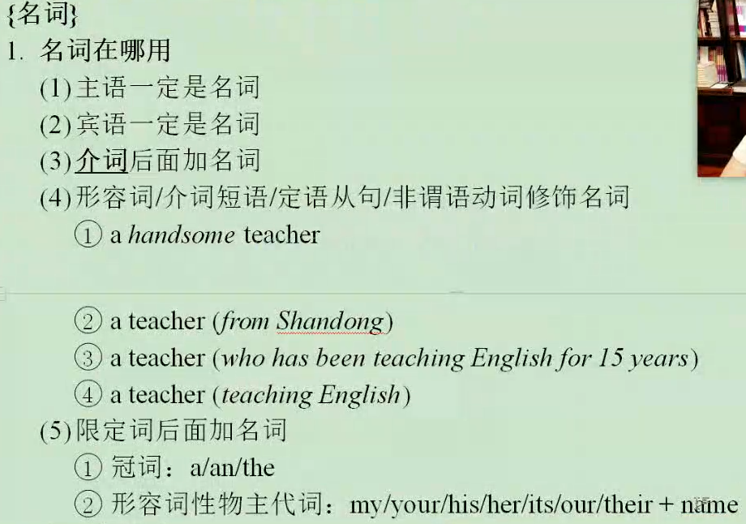
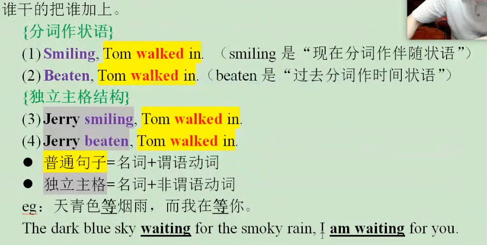

a teacher from shandong

a teacher who has been teaching english for 15 years

a teacher teaching english

## 名词

 

## 谓语动词

### 被动语态

​	被动就是 be/get+done

### 时态

​	do/does 常态(经常、真的)

​	**did** 	"动作=过去，句子=过去" (曾经、过去、当时，刚刚)

​	**have/has done**  "动作=过去，句子=现在" （已经）

​	**had done** "发生在did之前" 过去完成时

​	**would do** 发生在did的将来

​	will do 将要做某事	

​	will have done 将来完成 

​	be doing 正在

​	have/has/had been doing 一直一直在做（一直）

## 非谓语动词

​	做	doing

​	被做	done	

​	要做还没做	to do

​	要被做	to be done

​	之前做	having done

​	之前被做	having been done

​	正在被做	being done

## 形容词

## 副词

## 冠词

## 代词

## 介词

## 连词

## 并列

## 固搭 