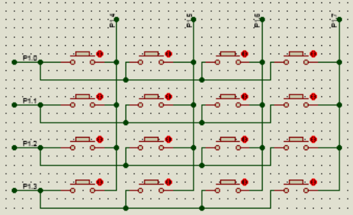

<p align="center">single-chip microcomputer</p>

#### code关键字

>​	——《手把手教你学51单片机-C语言版》
>
>​	我们定义变量时，一般用到 unsigned char 或者 unsigned int 这两个关键字，这样定义的变量都是放在我们的单片机的RAM中，在程序中可以随意去改变这些变量的值。但是还有一种数据,比如**数码管的字符显示数组**，我们在程序中要使用，但是却不会改变它的值。
>​    定义这种数据时可以加一个 code 关键字修饰一下，**这个数据就会存储到我们的程序空间 Flash 中**，这样可以**大大节省单片机的 RAM** 的使用量，毕竟我们的单片机 RAM 空间比较小，而程序空间则大的多。

...

#### Pull-up/down Resistor

[The Basics - Very Basicpng Circuits (archive.org)](https://web.archive.org/web/20110613082729/http://seattlerobotics.org/encoder/mar97/basics.html)  

| 上拉电阻(Pull-up resistors)       | 下拉电阻(Pull-down resistors):      |
| --------------------------------- | ----------------------------------- |
|  |  |

...

```
上拉电阻(Pull-up resistors):
当开关断开的时候，逻辑门的输入信号被上拉到Vin；
当开关闭合的时候，逻辑门的输入端与地面相连，输入信号接近0伏特。
```

​	所谓上拉电阻就是接电源正极，下拉的就是接负极或地。上拉就是将不确定的信号通过一个电阻钳位在高电平，电阻同时起限流作用。下拉同理，也是将不确定的信号通过一个电阻钳位在低电平。

```
	Most digital circuits use a 10k or a 47k resistor for pullups. The exact value doesn't actually matter, as long as it is high enough to prevent too much current from flowing. 10k seems to be the most common, but if you are hoping to save as much power as possible, the a 47k resistor may be right for your application. In some cases, you can go higher, but then you are depending on characteristics of the pins on the chip.
	"一般上拉电阻为10k左右，没必要精确。"
```

...

### 流水灯

#### 同方向

```c
void main(){
    uint i = 0;
    P2 = ~0x01;
    while(1){
        delay(11059200);
        P2 = ~(0x01<<i++);
        if(i>=8){
            i = 0;
        }
    }
}
```

#### 左右回荡

```c
// 左右来回荡的流水灯
void main(){
    uint mark = 0;
    uint i = 0;
    while(1){
        switch (mark){
            case 0:
                P2 = ~(0x01 << i++);
                if(i>=8)
                    mark = 1;i = 0;
                break;
            case 1:
                P2 = ~(0x80 >> i++);
                if(i>=8)
                    mark = 0;i = 0;
                break;
        }
        delay(0x4fff);
    }
}
```


...

### Nixie Display

**共阳极数码管**

```c
//无小数点
unsigned int code segArray[]={
    0xc0,0xf9,0xa4,0xb0,0x99,//0,1,2,3,4
    0x92,0x82,0xf8,0x80,0x90,//5,6,7,8,9
    0x88,0x83,0xc6,0xa1,0x86,0x8e//A,B,C,D,E,F
};
P2 = segArray[i];
```

...


#### 数码管显示

##### 原理图：

<p align="center"></p>

##### 代码块：

```c
void nixieDisplay(unsigned int pos,unsigned int num){
    unsigned int code segC[]={
        0x3f,0x06,0x5b,0x4f,0x66,
        0x6d,0x7d,0x07,0x7f,0x6f
    };
    unsigned int code position[]={
        0x00,0x01,0x02,0x03,0x04,0x05,0x06,0x07
    };
    P3 = position[pos-1];
    P2 = segC[num];
    /****消影****/
    delay(2);
    P2 = 0x00;
}
void main(){
    while(1){
        nixieDisplay(1,1);
        nixieDisplay(2,2);
        nixieDisplay(3,3);
    }
}
```

...

#### 秒表计时器

##### 原理图：

<p align="center"> </p>

##### 代码块：

```c
// 秒表计时器
void main(){
    unsigned int code segArray[]={
        0x3f,0x06,0x5b,0x4f,0x66,
        0x6d,0x7d,0x07,0x7f,0x6f
    };
    uint ledchar[8]={
    	0x00,0x00,0x00,0x00,0x00,0x00,0x00,0x00,
    };
    uint initialValue = 0xfc67;
    uint count = 0;
    uint i = 0;
    uint sec = 0;
    EA = 1;//总中断使能
    P3 = 0xff;
    P1 = 0x00;
    TMOD = 0x01;//设置 T0 为模式 1
    TH0 = (initialValue>>8) & 0xff;
    TL0 = initialValue & 0xff;
    TR0 = 1;//启动T0
    ET0 = 1;//使能T0中断
    while(1){
        if(TF0 == 1){
            TF0 = 0;
            TH0 = (initialValue>>8)&0xff;
            TL0 = (initialValue)&0xff;
            count++;
            if(count>=1000){
                count = 0;
                sec++;
                ledchar[0] = segArray[sec%10];
                ledchar[1] = segArray[sec/10%10];
                ledchar[2] = segArray[sec/100%10];
                ledchar[3] = segArray[sec/1000%10];
                ledchar[4] = segArray[sec/10000%10];
            }
            switch (i){
                case 0:P1=0x00;P2=ledchar[0];i++;break;
                case 1:P1=0x01;P2=ledchar[1];i++;break;
                case 2:P1=0x02;P2=ledchar[2];i++;break;
                case 3:P1=0x03;P2=ledchar[3];i++;break;
                case 4:P1=0x04;P2=ledchar[4];i++;break;
                case 5:P1=0x05;P2=ledchar[5];i=0;break;
            }
        }
    }
}
```

...

**dynamic display method of digital tube(数码管动态显示方法)**

**消影** 

**直接扫描** 

位选 段选 **清零** 位选 段选 **清零** 位选 段选 **清零** ...

有两个词，就是**位选和段选**。
**位选：其实就是控制哪一个数码管显示** 
**段选：其实就是控制数码管显示的内容** 

专用驱动芯片

使用 **TM1640** 专用驱动芯片，*TM1640* 是一种LED(发光二极管显示器)驱动控制专用电路


...

### Keyboard

#### 按键消抖

```c
//简易的延时消抖
```

...

```c
//使用中断的按键消抖

```

...

[MCU learning: MCU independent keys and matrix keyboard concepts and principles - Birost](https://blog.birost.com/a?ID=01600-024ccfca-f69e-47be-8d5c-a3e48274ec6f) 

#### Independent Keys


##### Flowchart
<p align="center">按键抬起后才会有效</p>

##### Code
```c
// 按键抬起有效,每次按下只会触发一次
if (key1 == 0){
    delay(30);//消抖
    while (key1 == 0);//等待按键抬起(只要按键一直按着，就会一直死循环)
	led1 = ~led1;
}

// 按下立即有效,每次按下只会触发一次
if(key1 == 0){
    delay(30);//消抖
    if (key1 == 0){
    	led1 = ~led1;
    }
    while(key1 == 0);//等待按键抬起(只要按键一直按着，就会一直死循环)        
}
```

#### Matrix Keyboard

Matrix keyboard is also called row-column keyboard(行列键盘).

<p align="center"></p>

```c
//按键扫描数组
unsigned int P1_scan[]={
    0x7f,0xbf,0xdf,0xef
}; 

// 4x4按键按下所对应的值
unsigned int matrixkeyValue4x4[]=
{
    0xee,0xed,0xeb,0xe7
    //高位为1110;1110,1101，1011，0111
    0xde,0xdd,0xdb,0xd7,
    //高位为1101;1110,1101，1011，0111
    0xbe,0xbd,0xbb,0xb7,
    //高位为1011;1110,1101，1011，0111
    0x7e,0x7d,0x7b,0x77 
	//高位为0111;1110,1101，1011，0111
};
// 3x3
unsigned int matrixkeyValue3x3[]=
{
	
    
    
};

```

......

```c
#include<reg51.h>
//按键扫描数组
unsigned char P1_scan[]={0x7f,0xbf,0xdf,0xef}; 
//4x4按键按下所对应的值
unsigned char key_temp_value[]={
    0xee,0xed,0xeb,0xe7,
    0xde,0xdd,0xdb,0xd7,
    0xbe,0xbd,0xbb,0xb7,
    0x7e,0x7d,0x7b,0x77
};   
//共阳极数码管显示
unsigned char seven_seg[10]={
    0xc0,0xf9,0xa4,0xb0,0x99,	   
    0x92,0x82,0xf8,0x80,0x90
};
void delay(unsigned int x){      //延时函数	
	while(x--);
}
unsigned char key_scan(){	 //键盘扫描函数
	unsigned i,j;
	for(i=0;i<4;i++){
		P1=P1_scan[i];
		if(P1!=P1_scan[i]){
			delay(200);			 //消抖
			if(P1!=P1_scan[i]){
				for(j=0;j<16;j++){  //检测按键值
					if(P1==key_temp_value[j])
					return(j);	  //返回按键值
				}
			}
		}
	}
	return(0xff);
}

void display(unsigned char i){
	P2=~0x01;P0 = seven_seg[i%10];		//显示按键编号个位
	delay(300);							//让个位显示一段时间
	P2=~0x02;P0 = seven_seg[i/10];		//显示按键编号十位
	delay(300);						   //让十位显示一段时间
	P0 = 0xff;						  //消隐
}
void main(){
	unsigned char i;
	while(1){
		i = key_scan();
		display(i);
	}
}
```

...

```c
#include <reg52.h>
sbit ADDR0 = P1^0;
sbit ADDR1 = P1^1;
sbit ADDR2 = P1^2;
sbit ADDR3 = P1^3;
sbit ENLED = P1^4;
sbit KEY_IN_1 = P2^4;
sbit KEY_IN_2 = P2^5;
手把手教你学 51 单片机-C 语言版 (更新：2017-3-15) http://www.kingst.org
118
sbit KEY_IN_3 = P2^6;
sbit KEY_IN_4 = P2^7;
sbit KEY_OUT_1 = P2^3;
sbit KEY_OUT_2 = P2^2;
sbit KEY_OUT_3 = P2^1;
sbit KEY_OUT_4 = P2^0;
unsigned char code LedChar[] = { //数码管显示字符转换表
 0xC0, 0xF9, 0xA4, 0xB0, 0x99, 0x92, 0x82, 0xF8,
 0x80, 0x90, 0x88, 0x83, 0xC6, 0xA1, 0x86, 0x8E
};
unsigned char LedBuff[6] = { //数码管显示缓冲区
 0xFF, 0xFF, 0xFF, 0xFF, 0xFF, 0xFF
};
unsigned char code KeyCodeMap[4][4] = { //矩阵按键编号到标准键盘键码的映射表
 { 0x31, 0x32, 0x33, 0x26 }, //数字键 1、数字键 2、数字键 3、向上键
 { 0x34, 0x35, 0x36, 0x25 }, //数字键 4、数字键 5、数字键 6、向左键
 { 0x37, 0x38, 0x39, 0x28 }, //数字键 7、数字键 8、数字键 9、向下键
 { 0x30, 0x1B, 0x0D, 0x27 } //数字键 0、ESC 键、 回车键、 向右键
};
unsigned char KeySta[4][4] = { //全部矩阵按键的当前状态
 {1, 1, 1, 1}, {1, 1, 1, 1}, {1, 1, 1, 1}, {1, 1, 1, 1}
};
void KeyDriver();
void main()
{
 EA = 1; //使能总中断
 ENLED = 0; //选择数码管进行显示
 ADDR3 = 1;
 TMOD = 0x01; //设置 T0 为模式 1
 TH0 = 0xFC; //为 T0 赋初值 0xFC67，定时 1ms
 TL0 = 0x67;
 ET0 = 1; //使能 T0 中断
 TR0 = 1; //启动 T0
 LedBuff[0] = LedChar[0]; //上电显示 0
 while (1)
 {
 KeyDriver(); //调用按键驱动函数
 }
}
/* 将一个无符号长整型的数字显示到数码管上，num-待显示数字 */
手把手教你学 51 单片机-C 语言版 (更新：2017-3-15) http://www.kingst.org
119
void ShowNumber(unsigned long num)
{
 signed char i;
 unsigned char buf[6];
 
 for (i=0; i<6; i++) //把长整型数转换为 6 位十进制的数组
 {
 buf[i] = num % 10;
 num = num / 10;
 }
 for (i=5; i>=1; i--) //从最高位起，遇到 0 转换为空格，遇到非 0 则退出循环
 {
 if (buf[i] == 0)
 LedBuff[i] = 0xFF;
 else
 break;
 }
 for ( ; i>=0; i--) //剩余低位都如实转换为数码管显示字符
 {
 LedBuff[i] = LedChar[buf[i]];
 }
}
/* 按键动作函数，根据键码执行相应的操作，keycode-按键键码 */
void KeyAction(unsigned char keycode)
{
 static unsigned long result = 0; //用于保存运算结果
 static unsigned long addend = 0; //用于保存输入的加数
 
 if ((keycode>=0x30) && (keycode<=0x39)) //输入 0-9 的数字
 {
 addend = (addend*10)+(keycode-0x30); //整体十进制左移，新数字进入个位
 ShowNumber(addend); //运算结果显示到数码管
 }
 else if (keycode == 0x26) //向上键用作加号，执行加法或连加运算
 {
 result += addend; //进行加法运算
 addend = 0;
 ShowNumber(result); //运算结果显示到数码管
 }
 else if (keycode == 0x0D) //回车键，执行加法运算(实际效果与加号相同)
 {
 result += addend; //进行加法运算
 addend = 0;
 ShowNumber(result); //运算结果显示到数码管
手把手教你学 51 单片机-C 语言版 (更新：2017-3-15) http://www.kingst.org
120
 }
 else if (keycode == 0x1B) //Esc 键，清零结果
 {
 addend = 0;
 result = 0;
 ShowNumber(addend); //清零后的加数显示到数码管
 }
}
/* 按键驱动函数，检测按键动作，调度相应动作函数，需在主循环中调用 */
void KeyDriver()
{
 unsigned char i, j;
 static unsigned char backup[4][4] = { //按键值备份，保存前一次的值
 {1, 1, 1, 1}, {1, 1, 1, 1}, {1, 1, 1, 1}, {1, 1, 1, 1}
 };
 
 for (i=0; i<4; i++) //循环检测 4*4 的矩阵按键
 {
 for (j=0; j<4; j++)
 {
 if (backup[i][j] != KeySta[i][j]) //检测按键动作
 {
 if (backup[i][j] != 0) //按键按下时执行动作
 {
 KeyAction(KeyCodeMap[i][j]); //调用按键动作函数
 }
 backup[i][j] = KeySta[i][j]; //刷新前一次的备份值
 }
 }
 }
}
/* 按键扫描函数，需在定时中断中调用，推荐调用间隔 1ms */
void KeyScan()
{
 unsigned char i;
 static unsigned char keyout = 0; //矩阵按键扫描输出索引
 static unsigned char keybuf[4][4] = { //矩阵按键扫描缓冲区
 {0xFF, 0xFF, 0xFF, 0xFF}, {0xFF, 0xFF, 0xFF, 0xFF},
 {0xFF, 0xFF, 0xFF, 0xFF}, {0xFF, 0xFF, 0xFF, 0xFF}
 };
 //将一行的 4 个按键值移入缓冲区
 keybuf[keyout][0] = (keybuf[keyout][0] << 1) | KEY_IN_1;
 keybuf[keyout][1] = (keybuf[keyout][1] << 1) | KEY_IN_2;
 keybuf[keyout][2] = (keybuf[keyout][2] << 1) | KEY_IN_3;
 keybuf[keyout][3] = (keybuf[keyout][3] << 1) | KEY_IN_4;
 //消抖后更新按键状态
 for (i=0; i<4; i++) //每行 4 个按键，所以循环 4 次
 {
 if ((keybuf[keyout][i] & 0x0F) == 0x00)
 { //连续 4 次扫描值为 0，即 4*4ms 内都是按下状态时，可认为按键已稳定的按下
 KeySta[keyout][i] = 0;
 }
 else if ((keybuf[keyout][i] & 0x0F) == 0x0F)
 { //连续 4 次扫描值为 1，即 4*4ms 内都是弹起状态时，可认为按键已稳定的弹起
 KeySta[keyout][i] = 1;
 }
 }
 //执行下一次的扫描输出
 keyout++; //输出索引递增
 keyout = keyout & 0x03; //索引值加到 4 即归零
 switch (keyout) //根据索引，释放当前输出引脚，拉低下次的输出引脚
 {
 case 0: KEY_OUT_4 = 1; KEY_OUT_1 = 0; break;
 case 1: KEY_OUT_1 = 1; KEY_OUT_2 = 0; break;
 case 2: KEY_OUT_2 = 1; KEY_OUT_3 = 0; break;
 case 3: KEY_OUT_3 = 1; KEY_OUT_4 = 0; break;
 default: break;
 }
}
/* 数码管动态扫描刷新函数，需在定时中断中调用 */
void LedScan()
{
 static unsigned char i = 0; //动态扫描的索引
 
 P0 = 0xFF; //显示消隐
 switch (i)
 {
 case 0: ADDR2=0; ADDR1=0; ADDR0=0; i++; P0=LedBuff[0]; break;
 case 1: ADDR2=0; ADDR1=0; ADDR0=1; i++; P0=LedBuff[1]; break;
 case 2: ADDR2=0; ADDR1=1; ADDR0=0; i++; P0=LedBuff[2]; break;
 case 3: ADDR2=0; ADDR1=1; ADDR0=1; i++; P0=LedBuff[3]; break;
 case 4: ADDR2=1; ADDR1=0; ADDR0=0; i++; P0=LedBuff[4]; break;
 case 5: ADDR2=1; ADDR1=0; ADDR0=1; i=0; P0=LedBuff[5]; break;
 default: break;
 }
}
/* T0 中断服务函数，用于数码管显示扫描与按键扫描 */
void InterruptTimer0() interrupt 1 {
	TH0 = 0xFC; //重新加载初值
    TL0 = 0x67;
    LedScan(); //调用数码管显示扫描函数
	KeyScan(); //调用按键扫描函数
}
```


...

### Interrupt

单片机的中断系统通过四个相关的特殊功能寄存器**TCON**、**SCON**、**IE**和**IP**来进行管理，因此用户可以用软件对每个中断的开和关以及优先级的控制作用

| 中断函数编号 | 中断名称  | 中断标志位 | 中断使能位 | 中断向量地址 | 默认优先级 |
| :----------: | :-------: | :--------: | :--------: | :----------: | :--------: |
|      0       | 外部中断0 |    IE0     |    EX0     |    0x0003    |  1(最高)   |
|      1       |  T0中断   |    TF0     |    ET0     |    0x000b    |     2      |
|      2       | 外部中断1 |    IE1     |    EX1     |    0x0013    |     3      |
|      3       |  T1中断   |    TF1     |    ET1     |    0x001b    |     4      |
|      4       | UART中断  |   TI/RI    |     ES     |    0x0023    |     5      |
|      5       |  T2中断   |  TF2/EXF2  |    ET2     |    0x002b    |     6      |

> **抢占优先级**
>
> ​	当进入低优先级中断中执行时，如又发生了高优先级的中断，则立刻进入高优先级中断 执行，处理完高优先级级中断后，再返回处理低优先级中断，这个过程就叫做中断嵌套，也 称为抢占。所以抢占优先级的概念就是，优先级高的中断可以打断优先级低的中断的执行， 从而形成嵌套。当然反过来，优先级低的中断是不能打断优先级高的中断的。
>
> **固有优先级**
>
> ​	既然不能抢占，那么这个优先级有什么用呢？ 答案是多个中断同时存在时的仲裁。比如说有多个中断同时发生了，当然实际上发生这 种情况的概率很低，但另外一种情况就常见的多了，那就是出于某种原因我们暂时关闭了总 中断，即 EA=0，执行完一段代码后又重新使能了总中断，即 EA=1，那么在这段时间里就很 可能有多个中断都发生了，但因为总中断是关闭的，所以它们当时都得不到响应，而当总中 断再次使能后，它们就会在同时请求响应了，很明显，这时也必需有个先后顺序才行，这就 是非抢占优先级的作用了——如表 6-3 中，谁优先级最高先响应谁，然后按编号排队，依次得到响应。
>
> ——《手把手教你学51单片机-C语言版》P78

...

### Motor

...

#### 步进电机

...

<p align="center"></p>
...
```c
void main(){
    unsigned char motorCw[] = {
        0xd,0x9,0xb,0x3,0x7,0x6,0xe,0xc
    };
    while(1){
        for(i=0;i<8;i++){
            P2 = (motorCw[i]|0xf0);
            delay(0xf8ff);
        }
    }
}
```

...

### 事故现场

#### error C141: syntax error near 'unsigned'

错误原因是变量的声明位置不当。

某些C编译器支持的C标准中，C语言**声明变量的位置应当在所有可执行语句之前**. 

...

### Mines

#### Flowchart

 

...

